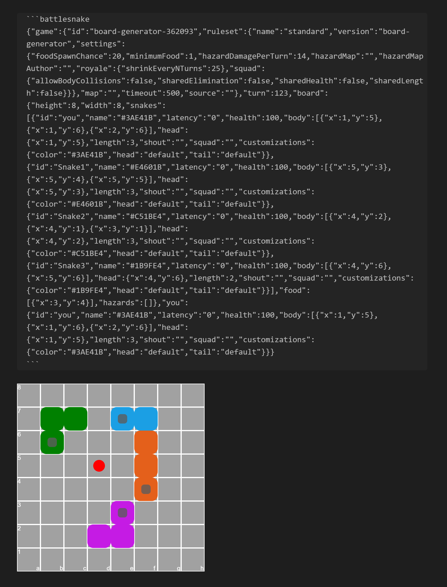

# Obsidian Chess Plugin

This plugin adds the capability to visualize BattleSnake JSON board positions on a SVG board directly in preview mode.

By design, this plugin is for visualization only. Do not expect interactivity or the possibility to handle entire games. This plugin want to render just a SVG image and it is optimized for visualization and HTML/PDF exports.

## How to use it

After you installed the plugin, just copy the JSON board inside a code block with the `battlesnake` language.

### Example

````
```battlesnake
{"game":{"id":"board-generator-362093","ruleset":{"name":"standard","version":"board-generator","settings":{"foodSpawnChance":20,"minimumFood":1,"hazardDamagePerTurn":14,"hazardMap":"","hazardMapAuthor":"","royale":{"shrinkEveryNTurns":25},"squad":{"allowBodyCollisions":false,"sharedElimination":false,"sharedHealth":false,"sharedLength":false}}},"map":"","timeout":500,"source":""},"turn":123,"board":{"height":8,"width":8,"snakes":[{"id":"you","name":"#3AE41B","latency":"0","health":100,"body":[{"x":1,"y":5},{"x":1,"y":6},{"x":2,"y":6}],"head":{"x":1,"y":5},"length":3,"shout":"","squad":"","customizations":{"color":"#3AE41B","head":"default","tail":"default"}},{"id":"Snake1","name":"#E4601B","latency":"0","health":100,"body":[{"x":5,"y":3},{"x":5,"y":4},{"x":5,"y":5}],"head":{"x":5,"y":3},"length":3,"shout":"","squad":"","customizations":{"color":"#E4601B","head":"default","tail":"default"}},{"id":"Snake2","name":"#C51BE4","latency":"0","health":100,"body":[{"x":4,"y":2},{"x":4,"y":1},{"x":3,"y":1}],"head":{"x":4,"y":2},"length":3,"shout":"","squad":"","customizations":{"color":"#C51BE4","head":"default","tail":"default"}},{"id":"Snake3","name":"#1B9FE4","latency":"0","health":100,"body":[{"x":4,"y":6},{"x":5,"y":6}],"head":{"x":4,"y":6},"length":2,"shout":"","squad":"","customizations":{"color":"#1B9FE4","head":"default","tail":"default"}}],"food":[{"x":3,"y":4}],"hazards":[]},"you":{"id":"you","name":"#3AE41B","latency":"0","health":100,"body":[{"x":1,"y":5},{"x":1,"y":6},{"x":2,"y":6}],"head":{"x":1,"y":5},"length":3,"shout":"","squad":"","customizations":{"color":"#3AE41B","head":"default","tail":"default"}}}
```
````



## How to compile the plugin

First, install the dependencies with

```bash
npm i
```

Then, you can compile the plugin with:

```bash
npm run build
```

This will create a `main.js` file in the project root. That is the entry point of the plugin.

## Planned Features

Nothing currently.
